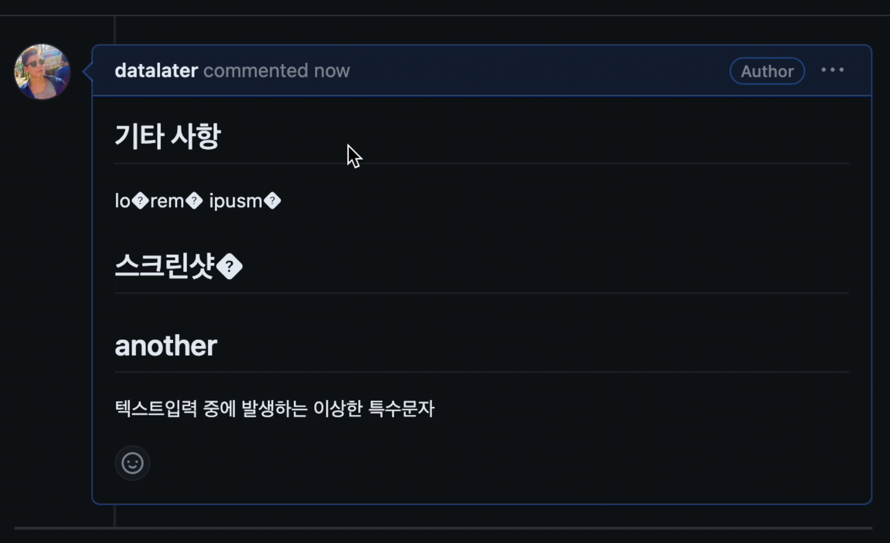

# TypoFix - 맥에서 이상한 특수문자 입력되는 문제 해결하기

- [데모](#데모)
- [희망적인 생각](#희망적인-생각)
  - [첫번째 희망](#첫번째-희망)
  - [두번째 희망](#두번째-희망)
- [병목과 돌파구](#병목과-돌파구)
- [함께 읽기](#함께-읽기)

아래와 같이 '�' 같은 이상한 특수문자가 나타나는 현상을 경험해보신 적이 있나요?



저는 맥북을 사용해서 개발하고 있는데요. PR을 작성할 때 위와 같이 이상한 특수문자가 가끔씩 나타나는 문제가 있었습니다.

때로는 그냥 지나치기도 했지만, 때로는 일일이 삭제하기도 했습니다. 리뷰어 입장에서도 PR을 읽을 때 불편할 것 같더라고요.
개인적으로 참 성가신 현상이라고 느꼈습니다.
그러다가 다른 동료들도 같은 문제를 겪고 있었고 불편함에 공감하고 있다는 것을 알게 되었습니다.
많은 사람들이 겪는 문제를 해결한다면 참 좋겠다는 생각이 들어서 다음과 같이 해결해봤습니다.

## 데모

> [datalater/typo-fix](https://github.com/datalater/typo-fix)

<video src="https://github.com/datalater/typo-fix/assets/8105528/c5fb3cbf-a14b-40aa-b88c-b07c56170383" controls autoplay></video>

데모 영상과 같이 잘 해결된 것을 확인할 수 있습니다. 더 이상 이상한 특수문자를 일일이 삭제할 일도 없고, 신경 쓰지 않아도 됩니다.
TypoFix 덕분에 원래 하던 일에 집중할 수 있게 되었습니다.

이제 TypoFix를 만드는 과정에서 어떤 병목을 겪었고 어떻게 해결했는지 설명하면서 전체적인 문제 해결 과정을 공유하겠습니다.

## 희망적인 생각

[문제 해결의 예술과 기술](https://www.amazon.com/Art-Craft-Problem-Solving/dp/0471789011)이라는 책에 보면 희망적인 생각(wishful thinking)이라는 접근법이 나옵니다.
문제가 이미 해결되었다고 희망적인 상황을 가정하고 문제를 풀어나가는 접근법입니다.

### 첫번째 희망

> 이상한 특수문자가 입력되는 현상이 아예 발생하지 않았으면 좋겠다

그런데 자료를 찾아보니 이와 같은 현상은 macOS에서 발생하는 문제이고 뚜렷한 해결책을 찾기 어려웠습니다. [^1]

그래도 자료 조사를 통해 알 수 있었던 단서가 몇 가지 있었습니다:

- 주로 맥에서 한글을 사용하는 경우에 발생하며 텍스트를 입력하다가 언어를 바꿔서 입력하거나 커서를 이동할 때 발생한다.
- 이상한 특수문자의 정체는 [제어 문자(control character)](https://ko.wikipedia.org/wiki/%EC%A0%9C%EC%96%B4_%EB%AC%B8%EC%9E%90) 또는 비인쇄 문자(non-printing character)이다.

### 두번째 희망

> 적어도 GitHub PR 작성할 때 발생하지 않았으면 좋겠다.

GitHub PR에서 특수문자가 나타나면 일일이 수동으로 지우면 문제가 해결됩니다. 하지만 이건 수동 작업이라 번거롭습니다.

> 브라우저에서 특수문자가 나타나면 일일이 지우는 수동 행동을 자동화하면 되겠다.

위 생각은 두 가지로 쪼갤 수 있습니다:

1. 특수문자가 나타나면 특수문자를 지운다
2. 브라우저에서 1번의 행동을 자동화한다

이를 기술적인 맥락으로 바꾸면 다음과 같습니다:

1. 특수문자가 나타나면<sup>Event</sup> → 특수문자를 지운다<sup>String.prototype.replace()</sup>
2. 크롬 확장 프로그램을 만들어서 1번을 수행하는 스크립트를 GitHub 사이트에서 실행한다

문제가 풀 수 있는 상태로 정의되었습니다. 이제 차근차근 구현하면 됩니다.

## 병목과 돌파구

> 타이핑하다가 특수문자가 생길 때마다 자동으로 삭제하면 좋을 것 같은데? input 이벤트를 쓰자!

`addEventListener('input', handler)`를 사용해서 타이핑할 때마다 특수문자를 삭제했더니 텍스트 삭제는 잘 되지만 커서가 맨 뒤로 이동하는 문제가 발생했습니다.
사용자가 원래 작성하고 있던 커서 위치가 변경되니 사용자 경험이 나빠졌습니다.

물론 커서 이동은 range나 selection API 등을 쓰면 해결할 수 있겠지만, 문제 해결 방식이 복잡해져서 좀 더 경제적이고 효과적인 방법을 찾아보기로 했습니다.

> 타이핑할 때 특수문자가 생기더라도 어쨌든 간에 submit 버튼을 누르면 그때 알아서 삭제하게 하면 어떨까?

텍스트를 작성하는 시점이 아니라 다른 시점을 생각해보니, 텍스트 작성과 submit 버튼을 클릭하는 사이의 타이밍에 특수문자를 삭제하면 될 것 같았습니다.
그 타이밍을 기술적으로 바꾸면 무엇일까요?

```ascii
+---------------+      ?     +----------------+
|  text typing  | ---------- |  button click  |
+---------------+   between  +----------------+
```

`blur` 이벤트였습니다.
데모에서 볼 수 있는 것처럼 preview 탭으로 이동하거나 submit 버튼을 클릭했을 때 특수문자가 사라지는 이유는 사용자가 입력하던 텍스트 입력창에서 `blur` 이벤트가 발생하기 때문입니다.

구체적인 코드는 다음과 같습니다:

```js
function bindHandler() {
  document.querySelectorAll('textarea').forEach((input) => {
    // here
    input.addEventListener('blur', function handler(event) {
      let encodedValue = encodeURI(event.target.value);

      if (!containsAny(encodedValue, FILTER_CHARACTERS)) return;

      FILTER_CHARACTERS.forEach((filterChar) => {
        const regex = new RegExp(escapeRegExp(filterChar), 'g');
        encodedValue = encodedValue.replace(regex, '');
      });

      event.target.value = decodeURI(encodedValue);
    });
  });
}
```

그런데 또 다른 문제가 있었습니다. 브라우저에서 GitHub 페이지에 접속하면 TypoFix 크롬 확장 프로그램이 실행되는데요.
이때 TypoFix 크롬 확장 프로그램은 콘텐츠 스크립트(content script)를 주입하여 DOM에서 텍스트 입력창을 모두 선택하여 특수문자를 감지하고 삭제하는 이벤트 리스너를 등록합니다.

그런데 GitHub PR에서 코멘트를 작성하고 나면 새로운 텍스트 입력창이 나타납니다.
이때 새로운 텍스트 입력창에는 이벤트 리스너가 등록되어 있지 않기 때문에 새 텍스트 입력창에서는 특수문자가 삭제되지 않습니다.

> 새로운 텍스트 입력창이 나타나면 이벤트 리스너를 추가로 등록한다.

위 요구사항을 기술적으로 구현하기 위해 좀 더 명확히 정의해보겠습니다.

- 새로운 텍스트 입력창이 나타나는 것을 감지한다는 것은 DOM 변경을 감지한다는 뜻이다.
  - DOM 변경을 감지하려면 `MutationObserver`를 사용하면 된다.
- 이미 이벤트 리스너가 등록되어 있는 텍스트 입력창에는 다시 등록하지 않아야 한다. 따라서 이벤트 리스너를 등록할 때, 이미 등록된 이벤트 리스너인지 확인해야 한다.
  - 이벤트를 추가할 때 추가했다는 표시(flag)를 `data-attribute`를 사용해서 남긴다.

모호했던 요구사항이 기술적으로 명확하게 정의되었습니다. 코드로 구현하면 다음과 같습니다:

```js
main();

function main() {
  // 🤓 스크립트가 최초로 실행되는 시점에 이벤트 리스너를 등록한다.
  bindHandler();

  // 🤓 DOM 변경이 감지된 시점에 이벤트 리스너를 등록한다.
  const observer = new MutationObserver((mutations) => {
    mutations.forEach((mutation) => {
      if (mutation.type === 'childList') {
        bindHandler();
      }
    });
  });

  observer.observe(document.body, {
    childList: true,
    subtree: true,
  });
}

function bindHandler() {
  document.querySelectorAll('textarea').forEach((input) => {
    // 🤓 이미 이벤트 리스너가 등록되어 있는 경우, 다시 등록하지 않는다.
    if (input.dataset.alreadyBound) return;
    input.dataset.alreadyBound = 'true';

    input.addEventListener('blur', function handler(event) {
      let encodedValue = encodeURI(event.target.value);

      if (!containsAny(encodedValue, FILTER_CHARACTERS)) return;

      FILTER_CHARACTERS.forEach((filterChar) => {
        const regex = new RegExp(escapeRegExp(filterChar), 'g');
        encodedValue = encodedValue.replace(regex, '');
      });

      event.target.value = decodeURI(encodedValue);
    });
  });
}
```

## 함께 읽기

전체 코드를 보고 싶거나 TypoFix 크롬 확장 프로그램을 직접 사용하고 싶다면 [datalater/typo-fix](https://github.com/datalater/typo-fix)를 참고해주세요. ⭐️

[^1]: 비슷한 문제를 겪는 사람들의 글

    - [Apple Community - Korean keyboard keeps mistyping](https://discussions.apple.com/thread/253806606?sortBy=best)
    - https://github.com/microsoft/vscode/issues/148356
    - https://github.com/microsoft/vscode/issues/171388
    - https://jybaek.tistory.com/954
